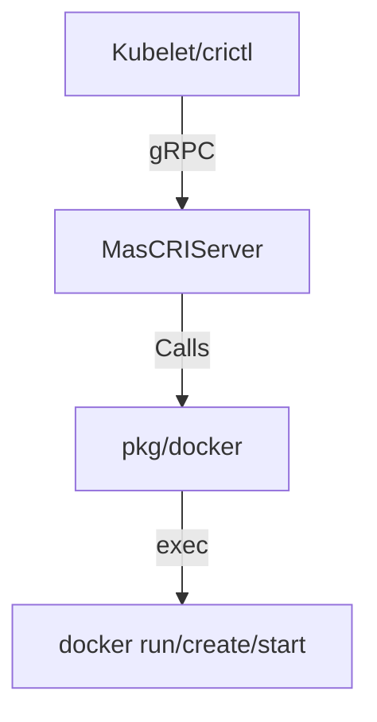

# Implementation Plan - Feature 002: Docker Backend

**Goal**: Transform MasCRI from a mock runtime into a functioning container runtime by integrating with Docker.
**Feature Branch**: `002-cri-docker-backend`

## Technical Approach

We will implement the "Adapter Pattern". MasCRI acts as a translator (Shim) between CRI gRPC requests and the Docker CLI.

1.  **Direct Docker ID Mapping**: We will use Docker's native Container IDs as CRI's `PodSandboxId` and `ContainerId`. This avoids the need for a complex internal state database (SQLite/Bbolt) for this educational phase.
2.  **The "Pause" Container**: Following K8s best practices, `RunPodSandbox` will start a "pause" container to hold the namespaces (Network, IPC, PID).
3.  **Command Wrapper**: We will create `pkg/docker` package to safely wrap `exec.Command`.

### Architecture Change

## Proposed Changes

### 1. New Package: `pkg/docker`

Encapsulate all OS interactions here.

#### [NEW] [adapter.go](file:///Users/jiwn2/dev/masallsome/mascri/pkg/docker/adapter.go)

- `type Adapter struct {}`
- `PullImage(image string) error`
- `RunSandbox(config *SandboxConfig) (string, error)` (Returns ID)
- `CreateContainer(sandboxID string, config *ContainerConfig) (string, error)`
- `StartContainer(containerID string) error`
- `ListContainers() ([]Container, error)`
- `InspectContainer(id string) (*ContainerInfo, error)`

### 2. Update Server Struct

#### [MODIFY] [server.go](file:///Users/jiwn2/dev/masallsome/mascri/pkg/server/server.go)

- Add `docker helper` field to `MasCRIServer`.
- Initialize it in `NewMasCRIServer`.

### 3. Implement Image Service

#### [NEW] [image.go](file:///Users/jiwn2/dev/masallsome/mascri/pkg/server/image.go)

- Move `ImageService` methods here (cleaner than putting everything in runtime.go).
- Implement `PullImage` -> `s.docker.PullImage`
- Implement `ListImages` -> `s.docker.ListImages`
- Implement `ImageStatus` -> `s.docker.InspectImage`

### 4. Implement Runtime Service (The Core)

#### [MODIFY] [runtime.go](file:///Users/jiwn2/dev/masallsome/mascri/pkg/server/runtime.go)

- **RunPodSandbox**:
  - Call `s.docker.RunSandbox`.
  - Logic: `docker run -d --name k8s_POD_<meta.name>_<meta.ns>_<uid> --net=none registry.k8s.io/pause:3.9`
  - (Note: We use `--net=none` or host initially, we will refine networking in phase 3).
- **CreateContainer**:
  - Call `s.docker.CreateContainer`.
  - Logic: `docker create --name k8s_<container_name>_<meta.name>... --net=container:<sandbox_id> <image>`
- **StartContainer**:
  - Call `s.docker.StartContainer`.
- **ListPodSandbox / ListContainers**:
  - Filter `docker ps` results.

## Verification Plan

### Automated

We don't have unit tests for `exec.Command` yet (mocking exec is complex). We rely on integration tests.

### Manual Verification (The "Golden Path")

1.  **Pull Test**: `crictl pull alpine` -> Check `docker images`.
2.  **Sandbox Test**: `crictl runp sandbox-config.json` -> Check `docker ps` for a container named `k8s_POD_...` (the pause container).
3.  **Container Test**: `crictl create <pod-id> container-config.json sandbox-config.json` -> Check `docker ps -a` for created container.
4.  **Start Test**: `crictl start <container-id>` -> Check `docker ps` that it's up.
