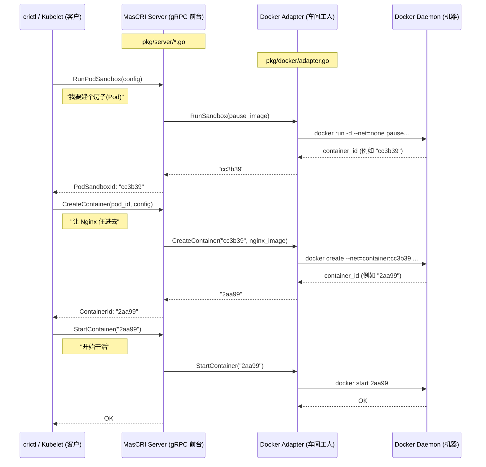

# 演示流程：Docker 后端集成 (特性 002)

## 1. 架构概览

我们已经成功将 MasCRI 从一个只会返回假数据的 Mock 运行时，改造成了真正适配 Docker 的容器运行时。

### 调用链分析 (Call Stack)

当 Kubelet (或者 crictl) 发送请求时，数据流向如下：



```mermaid

```

## 2. 验证步骤 (黄金路径)

请按照以下步骤验证完整的生命周期。

### 前置条件

1.  **启动 MasCRI**:
    ```bash
    make run
    # 保持这个终端打开，不要关闭
    ```
2.  **预拉取 Pause 镜像** (可选，但推荐，为了避免超时):
    ```bash
    docker pull registry.k8s.io/pause:3.9
    ```

### 第一步：拉取镜像 (Pull Image)

```bash
crictl --runtime-endpoint unix:///tmp/mascri.sock pull nginx:alpine
```

- **预期结果**: 显示 `Wait...` 然后成功结束。
- **验证**: 运行 `docker images | grep nginx` 应该能看到该镜像。

### 第二步：创建 Pod 沙箱 (盖房子)

```bash
# 创建配置文件
echo '{"metadata": {"name": "nginx-sandbox", "namespace": "default", "uid": "1", "attempt": 1}}' > sandbox.json

# 运行 (加上 20s 超时以防网络慢)
crictl --runtime-endpoint unix:///tmp/mascri.sock -t 20s runp sandbox.json
```

- **预期结果**: 返回一个长 ID (例如 `cc3b39...`)。
- **验证**: 运行 `docker ps` 能看到一个名字类似 `k8s_POD_nginx-sandbox...` 的容器。

### 第三步：创建并启动容器 (迎客入驻)

```bash
# 创建配置文件
echo '{"metadata": {"name": "nginx"}, "image": {"image": "nginx:alpine"}}' > container.json

# 获取上一步生成的 POD_ID
export POD_ID=<把你的 POD ID 粘贴在这里>

# 创建 (Create)
crictl --runtime-endpoint unix:///tmp/mascri.sock create $POD_ID container.json sandbox.json
# 输出: CONTAINER_ID

# 启动 (Start)
export CONTAINER_ID=<把上面输出的容器 ID 粘贴在这里>
crictl --runtime-endpoint unix:///tmp/mascri.sock start $CONTAINER_ID
```

### 第四步：最终检查

```bash
docker ps
```

你应该能看到 **两个** 正在运行的容器：

1.  `k8s_nginx_...` (Nginx 业务容器, 状态 Up)
2.  `k8s_POD_...` (Pause 沙箱容器, 状态 Up)

这证明 MasCRI 成功指挥 Docker 模拟出了 Kubernetes Pod 的行为！

## 3. 常见问题 (Troubleshooting)

- **超时错误 (DeadlineExceeded)**: 如果 `runp` 报超时，通常是因为拉取 Pause 镜像太慢。请先手动运行 `docker pull registry.k8s.io/pause:3.9`。
- **名称冲突 (Conflict)**: 如果你重复运行测试，可能会因为同名容器已存在而报错。运行 `docker rm -f $(docker ps -aq)` 清理环境后再试。
